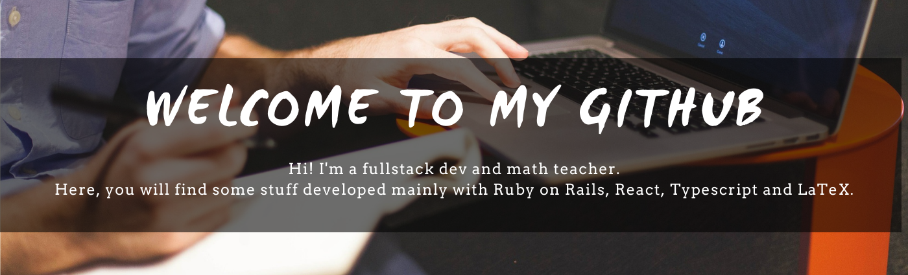
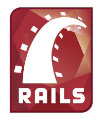
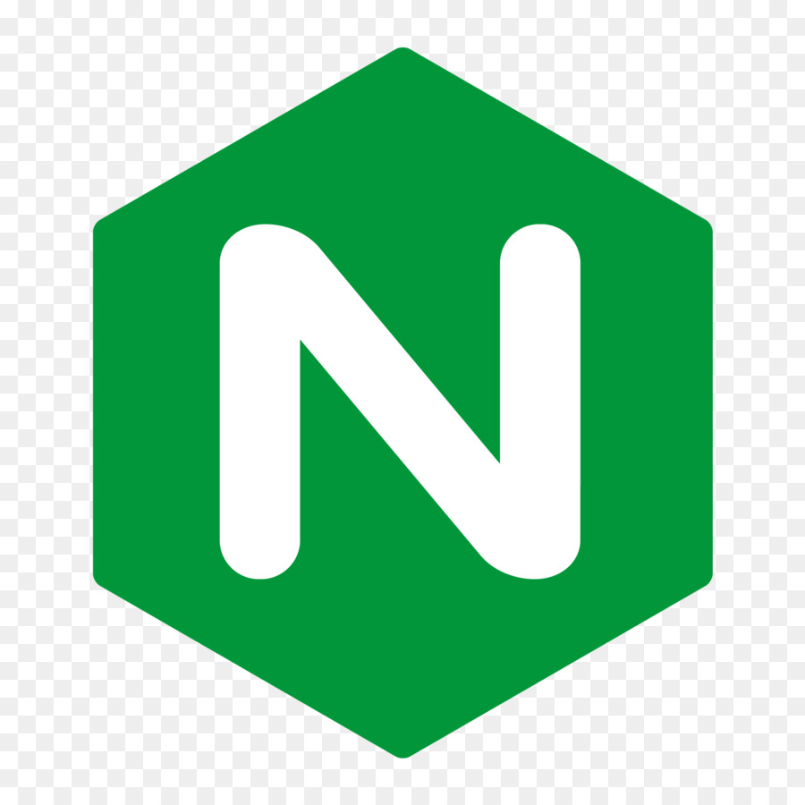

# Juan Manuel Maffei

## Working on

🔭 I'm currently working on [TransmediAcademy](https://github.com/juanmamaffei/transmediAcademy) (a Virtual Learning Environment for my MBA project thesis) and [Chamber Of Secrets](https://github.com/juanmamaffei/chamber_of_secrets) (a simple password manager, that I use all the time because I have fish memory). Both apps are in pre-alpha... you can see them and use them in [transmediacademy.com](http://transmediacademy.com) and [chamberofsecrets.xyz](http://chamberofsecrets.xyz).

Also, I'm preparing a Ruby Course... you can see [previews here](https://www.youtube.com/channel/UCzBUFrutEKAkIxWZedqXn1w/videos).

## Portfolio

- Clic [here](https://portfolio-juanmamaffei.vercel.app/) to see my [portfolio](https://portfolio-juanmamaffei.vercel.app/)!

- Clic [here](./pdf/resume.pdf) to see my [resume](./pdf/resume.pdf).

## Connect

 [juanmamaffei](https://www.linkedin.com/in/juanmamaffei/)

## Technologies

              

<!--
### Hi there 👋

**juanmamaffei/juanmamaffei** is a ✨ _special_ ✨ repository because its `README.md` (this file) appears on your GitHub profile.

Here are some ideas to get you started:

- 🔭 I’m currently working on ...
- 🌱 I’m currently learning ...
- 👯 I’m looking to collaborate on ...
- 🤔 I’m looking for help with ...
- 💬 Ask me about ...
- 📫 How to reach me: ...
- 😄 Pronouns: ...
- ⚡ Fun fact: ...

https://www.linkedin.com/in/juanmamaffei/

https://jmmaffei.com

https://www.youtube.com/c/juanmamaffei

-->
